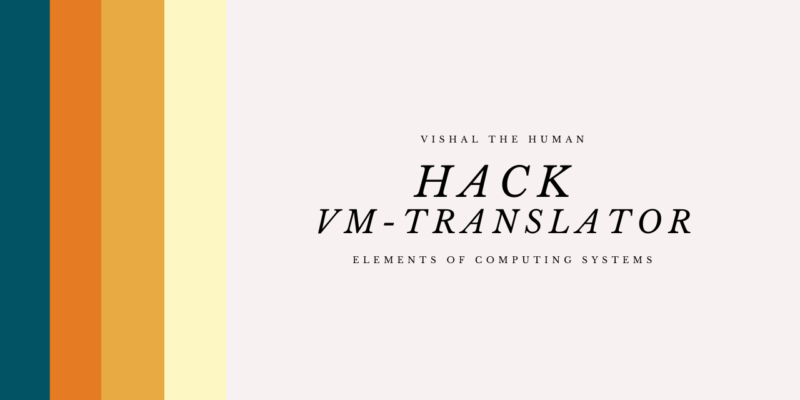

# **Hack-VM-Translator 💻📟**


## **Description**
🟡 The **Hack VM Translator** is a software tool used in the Nand2Tetris course to translate high-level code written in the Hack VM language into low-level code written in Hack Assembly language. The translator is responsible for converting the VM code into a series of assembly language instructions that can be executed on the Hack computer platform. The Hack VM Translator in this project is done in python. <br>
🟢 The virtual machine is stack-based: all operations are done on a stack. It is also function-based: a complete VM program is organized in program units called functions, written in the VM language. Each function has its own stand-alone code and is separately handled. The VM language has a single 16-bitdata type that can be used as an integer, a Boolean, or a pointer. <br><br>**The language consists of four types of commands:**<br><br>
    🟥   **Arithmetic commands** perform arithmetic and logical operations on the stack.<br>
    🟧	**Memory access commands** transfer data between the stack and virtual memory segments.<br>
    🟨	**Program flow commands** facilitate conditional and unconditional branching operations.<br>
    🟩	**Function** calling commands call functions and return from them.<br>
## **Types of Memory Segments 📝**
    • static 
    • local
    • argument
    • constant
    • this
    • that
    • pointer
    • temp

## **Types of Arithmetic/Logical Commands 💬**
    • add
    • sub
    • neg
    • eq
    • gt
    • lt
    • and
    • or
    • not

## **Types of Memory Access Commands 📖**
    • pop segment i
    • push segment i

## **Types of Branching Commands 🌿**
    • label label
    • goto label
    • if-goto label

## **Types of Function Commands 😶‍🌫️**
    • function functionName nVars
    • call functionName nArgs
    • return

## **Example**
### **StaticTest.vm**
```
// This file is part of www.nand2tetris.org
// and the book "The Elements of Computing Systems"
// by Nisan and Schocken, MIT Press.
// File name: projects/07/MemoryAccess/StaticTest/StaticTest.vm

// Executes pop and push commands using the static segment.
push constant 111
push constant 333
push constant 888
pop static 8
pop static 3
pop static 1
push static 3
push static 1
sub
push static 8
add
```

### **StaticTest.asm**
```
@256
D=A
@SP
M=D
@2048
D=A
@LCL
M=D
@3000
D=A
@ARG
M=D
@5000
D=A
@THIS
M=D
@7000
D=A
@THAT
M=D
@16
D=A
@14
M=D
//push constant 111
@111
D=A
@SP
A=M
M=D
@SP
M=M+1

//push constant 333
@333
D=A
@SP
A=M
M=D
@SP
M=M+1

//push constant 888
@888
D=A
@SP
A=M
M=D
@SP
M=M+1

//pop static 8
@StaticTest.8
D=A
@R15
M=D
@SP
AM=M-1
D=M
@R15
A=M
M=D
//pop static 3
@StaticTest.3
D=A
@R15
M=D
@SP
AM=M-1
D=M
@R15
A=M
M=D
//pop static 1
@StaticTest.1
D=A
@R15
M=D
@SP
AM=M-1
D=M
@R15
A=M
M=D
//push static 3
@StaticTest.3
D=M
@SP
A=M
M=D
@SP
M=M+1

//push static 1
@StaticTest.1
D=M
@SP
A=M
M=D
@SP
M=M+1

//sub
@SP
M=M-1
A=M
D=M
@SP
M=M-1
A=M
M=M-D
@SP
M=M+1

//push static 8
@StaticTest.8
D=M
@SP
A=M
M=D
@SP
M=M+1

//add
@SP
M=M-1
A=M
D=M
@SP
M=M-1
A=M
M=D+M
@SP
M=M+1


(END)
@END
0;JMP

```